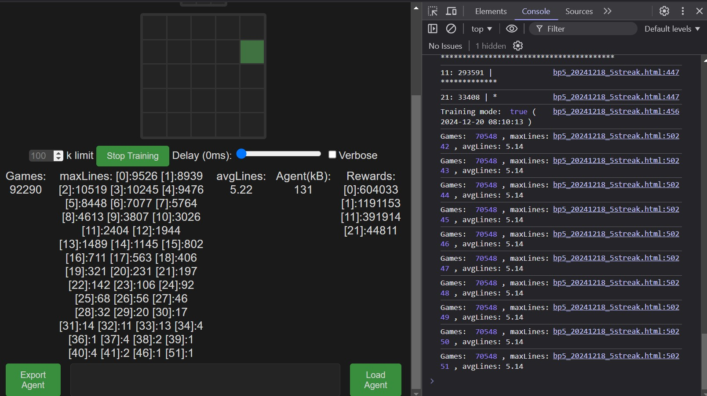

# BlockPuzzle Play, AI Play & Train

[Demos](https://kviksna.github.io/BlockPuzzle-AI-Play/)
* [5x5](bp5_20241220_5streak.html) (Trained models: [3.7M](bp5_games_3.7M_lines72.json.txt), [4.1M](bp5_games_4.1M_lines73.json.txt), [7M](bp5_games_7M_lines153.json.txt))
* [5x5 Random](bp5_20241218_5streak_rnd.html)
* [9x9](bp9_b4_20241220.html)
* [9x9 Random](bp9_b4_20241220_rnd.html)

## Credits
- [REINFORCEjs](https://github.com/karpathy/reinforcejs) - Reinforcement Learning library that implements several common RL algorithms by Andrej Karpathy.
