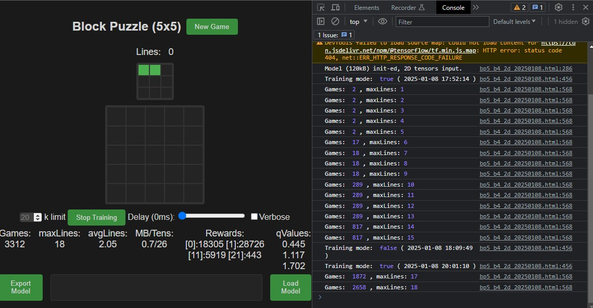

# BlockPuzzle Play, AI Play & Train with TensorFlow.js

* [TFjs 5x5](bp5_b4_2d_20250108.html)

## Credits
- [TensorFlow.js](https://github.com/tensorflow/tfjs) - TensorFlow.js is an open-source hardware-accelerated JavaScript library for training and deploying machine learning models. (by Google ? )
